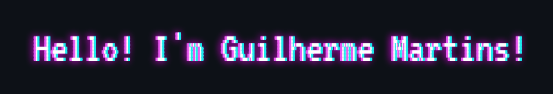

<p align="center">
  
</p>

<p align="center">
  
</p>

<p align="center">
  <a target="_blank" href="https://www.linkedin.com/in/guilhermemmp">
    
  </a>
</p>


### **🧐 About:**

```diff
@@I'm a lover of technology and games@@

+ Living in Rio de Janeiro, Brazil
- 19 years old 
! Studying NodeJS and some other things
# Interested in Java, Python and the infinite monkey theorem
```

### 🛠 **My Tools:**

<div align="center">
  


 


</div>
